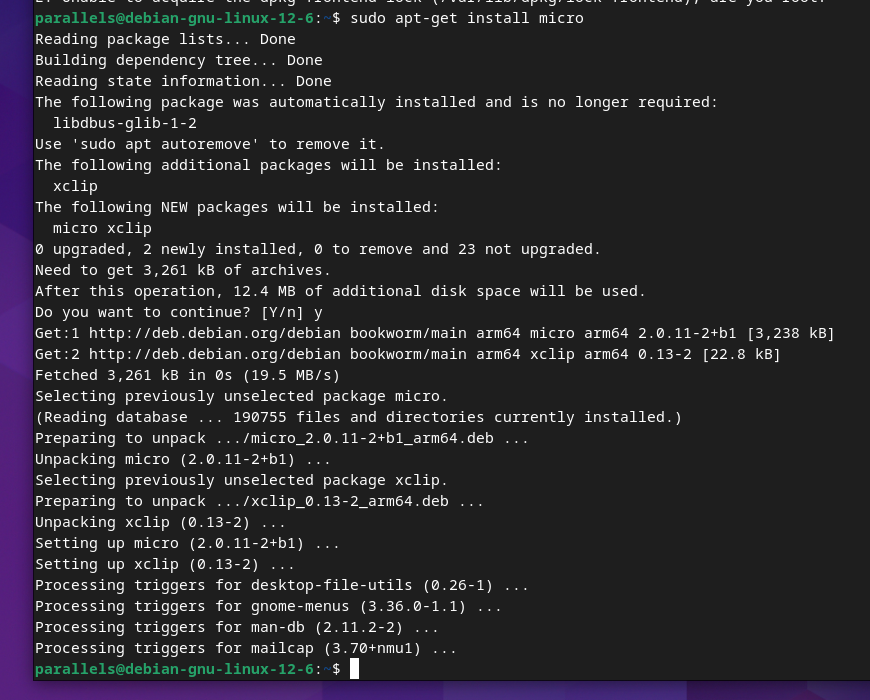
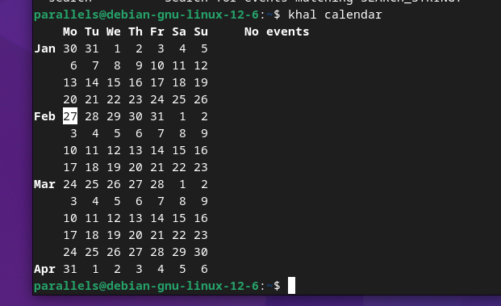
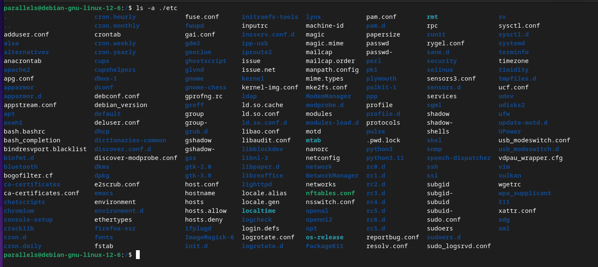
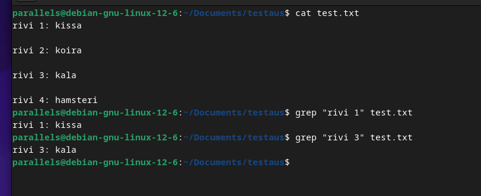
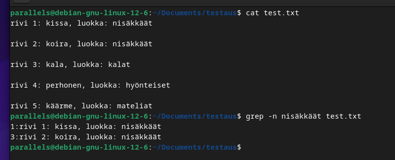
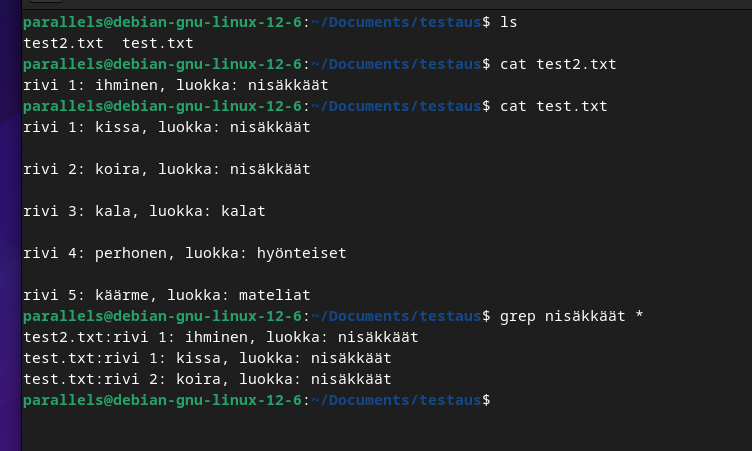
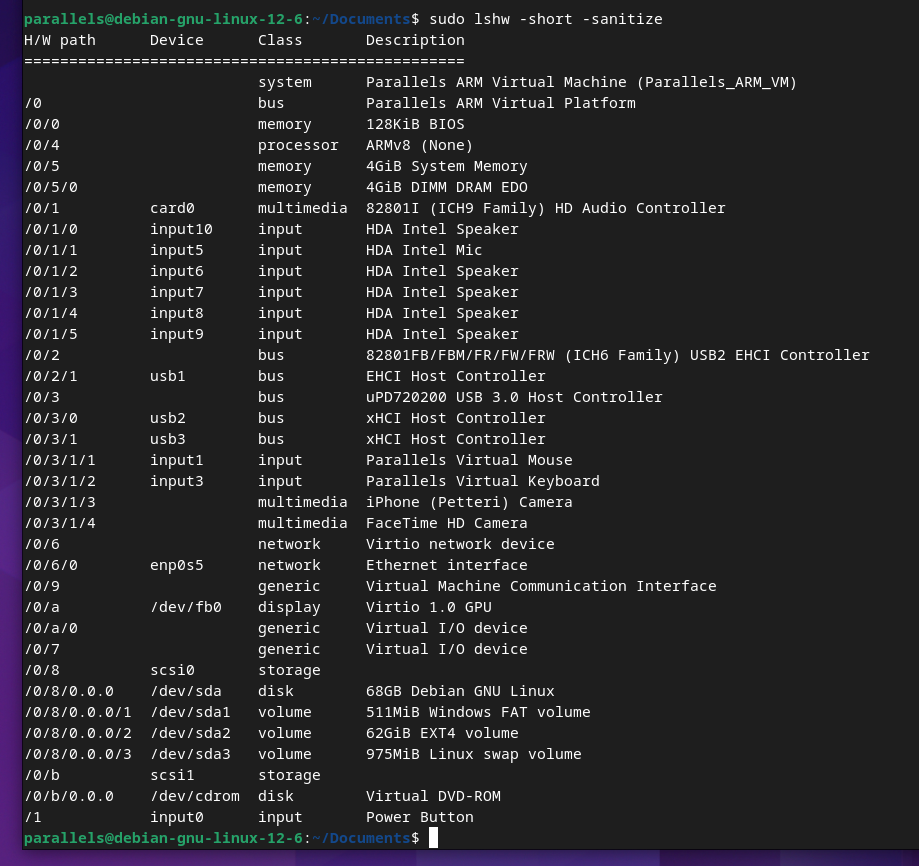

# Tehtävä h2

#### x) Lue ja tiivista https://terokarvinen.com/2020/command-line-basics-revisited/?fromSearch=command%20line%20basics%20revisited

- Linuxin käyttämä command line ja BSD (Berkley Sostware Distribution: [lähde](https://docs.freebsd.org/en/articles/explaining-bsd/)) ovat olleet käytössä pitkään ja selvinneet ajan testistä.

- Komento mv mahdollistaa tiedoston uudelleen nimämisen tai siirtämisen toiseen hakemistoon.

```
$ mv oldname newname #jos target on hakemisto, oldname siirretään sinne
```

- Etä command shellin voi avata ja kopioida hakemiston omalta koneelta etäkoneella komennolla:

```
ssh example@example.com
scp -r FOLDER example@example.com:public_html/ #exit remote koneesta ennen komennon antamista
```

- Linuxin hakemistot on määritetty Filesystem Hierarchy Strandard:ssa ja ovat samat kaikissa Linux-järjestelmissä.

<br>

#### a) Micro. Asenna micro-editori.



<br>

#### b) Asenne kolme itsellesi uutta komentoriviohjelmaa.

Päätin asentaa seuraavat ohjelmat: tree, iftop khal

```
sudo apt-get install tree iftop khal
```

tree


iftop


khal


<br>

#### c) FHS. Esittele kansiot, jotka on listattu "Command Line Basics Revisited" kappaleessa "Important directories"

/


/home/


/home/parallels/


/etc/


/media/


/var/log/


<br>

#### d)  The Friendly M. Näytä 2-3 kuvaavaa esimerkkiä grep-komennon käytöstä.








<br>

#### e)  Pipe. Näytä esimerkki putkista (pipes, "|").


<br>

#### f) Rauta. Listaa testaamasi koneen rauta (‘sudo lshw -short -sanitize’).



- -sanitize optio antaa outputin missä ei ole  sensitiivistä informaatiota, kuten IP-osoitteita, sarjanumeroita jne.


- H/W path mahdollisesti numeerinen string hardware komponenteista [lähde](https://www.bleepingcomputer.com/forums/t/565295/linux-hw-paths/?p=3614874)

- Class on korkean tason view Linuxin Device Model:sta, joka abstracts implementation details [lähde](https://linux-kernel-labs.github.io/refs/heads/master/labs/device_model.html#classes). 

- system tarkoittaa mahdollisesti virtuaalikonetta itseään

- bus on kommunikointikanava prosessorin ja input/output laitteen välillä [lähde](https://linux-kernel-labs.github.io/refs/heads/master/labs/device_model.html#buses). Eli /0 on mahdollisesti virtuaalikoneen itsensä bus, johon virtuaalikoneen muut osat voivat liittyä.

- Oletettavasti BIOS:lla on 128KiB muistia.

- Prosessorinan on ARMv8 v8 voisi olettaa tarkoittavan virtuaalista tai jotain siihe liittyvää.

- Virtuaalikoneella on 4GiB muistia.

- Tallennustilana on 68GB. Mielenkiintoisesti /dev/ hakemisto näyttää tältä:


<br>

#### g) Valitse muutama rivi lokeista.

Aiemmin iftop teki login, jossa näkyi yhteys amazonin ec2 instanssiin. Aika siisti!


Logissa näkyy window manager warningit kun käytin komentoa ensin ilman sudoa. Alimpana näkyy logi siitä, että syötin sudo jourlanctl -n komennon.


#### h) Asenna jokin plugin micro-editorille ja kokeile sitä.


