# Tehtävä h5 - Nimekäs

#### Laite jolla tehtävät tehdään:

- Apple MacBook Pro M2 Max
- macOS Sequoia 15.3.1
- Parallels ARM Virtual Machine
- Debian GNU/Linux 12.6 

Tehtävät ovat Tero Karvisen opintojaksolta Linux palvelimet ja löytyvät osoitteesta: https://terokarvinen.com/linux-palvelimet/.

### a) Nimi. Laita julkinen nimi osoittamaan omaan koneeseesi.

Edellisestä [h4 tehtävästäni](https://github.com/pinkkila/linux-course/blob/main/tehtava-h4.md) minulla oli valmiina AWS:n palvelimella nettisivu pyörimässä, jolle päätin laittaa tehtävän mukaisen julkisen nimen.  

Olin jo aiemmin ostanut vuokrannut AWS:stä itselleni oman sukunimeni mukaisen domainin ja päätin käyttää sitä. AWS:ssä nimiin liittyvät palvelut ovat Route 53 nimisen palvelun alla, josta pystyn tarkistamaan myös vuokraamiani nimiä:

Nimen vuokraaminen AWS:n kautta oli suht helppoa, eikä vaatinut kuin omien tietojen syöttämistä. Hinta valitsemalleni nimelle oli vuodeksi 14 dollaria plus verot.

Ainakin omasta mielestäni AWS:n palveluissa on aina oma selvittämisensä siinä, millä nimellä mitäkin palvelua kutsutaan, mitä sillä voi tehdä ja miten. Kun vuokrasin nimen katsoin tämän Tiny Tecnical Tutorialsin [videon](https://www.youtube.com/watch?v=JRZiQFVWpi8&t=396s). Tuota samaa videota tulen varmastikkin käyttämään useamman kerrankin lähteenä ja jatkossa käytän siitä nimeä "TTT-video". 

Tunnilla käydyn perusteella tiesin, että minun tulisi tehdä A Record. A Record:a käytetään linkittämään domain IP-osoitteeseen. Lähde TTT-video.

TTT-videon ohjeilla pystyin tekemään tämän aika helposti:

- Recordin nimeksi en laittanut mitään, koska halusin käyttää root domainia. 

- Valueen tuli EC2-instanssini public IP-osoite. Lähde: TTT-video.

- TTL (time to live): "The amount of time, in seconds, that you want DNS recursive resolvers to cache information about this record." Lähde: AWS [Values specific for simple records](https://docs.aws.amazon.com/Route53/latest/DeveloperGuide/resource-record-sets-values-basic.html)

- Routing policy: Simple routing on yksinkertainen standardi DNS toiminnallisuus. Lähde: AWS [Simple Routing](https://docs.aws.amazon.com/Route53/latest/DeveloperGuide/routing-policy-simple.htmlf)

Nyt osoite `http://pinkkila.com/` menee EC2-instannisillani olevalle Apache-serverin nettisivulle. 

Meneekö (ei varmastikkaa mene) osoite `www.pinkkila.com` EC2-instanssiin?

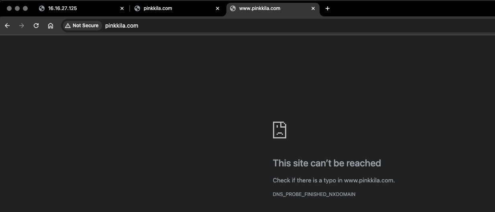

Ei mennyt joten tehdään kuten tässä [ohjeessa](https://aws.amazon.com/awstv/watch/47ebee0e261/):

Ja hetken päästä toimi:

### b) Based. Laita Name Based Virtual Host näkymään uudessa nimessäsi. Kotisvuja pitää pystyä muokkaamaan ilman pääkäyttäjän oikeuksia.

Tämä minulla on jo ja sivun muokkaus onnistuu ilman pääkäyttäjän oikeuksia.

### c) Kotisivu. Tee vähintään kolmen erillisen alasivun (esim. index.html, blog.html, projects.html) kotisivu ja kopioi se näkymään palvelimellesi. Sivujen muokkaamisen pitää onnistua ilman pääkäyttäjän oikeuksia, niiden kopioiminen pääkäyttäjänä testisivun paikalle ei käy. Kotisivujen ei tarvitse olla hienoja, mutta niiden tulee olla validia HTML:ää ja linkittää toisiinsa.

Linkkasin sivut vain toisiinsa a-tagilla ja se toimi. 

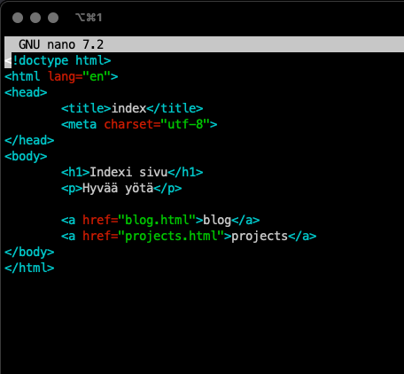

### d) Alidomain. Tee kaksi uutta alidomainia, jotka osoittava omaan koneeseesi. Esimerkiksi palvelu on example.com -> linuxkurssi.example.com. Alidomainit ovat tyypillisesti ilmaisia, kun sinulla on päädomain (example.com). Tässä tehtävässä riittää, että alidomainit avaavat saman sivun kuin päädomain. (Vapaaehtoinen bonus: Tee toinen alidomain A-tietueella ja toinen CNAME-tietueella. Vapaaehtoinen bonus: tee alidomainiin oma erillinen name based virtual host.)

Oletettavastikkin näin:

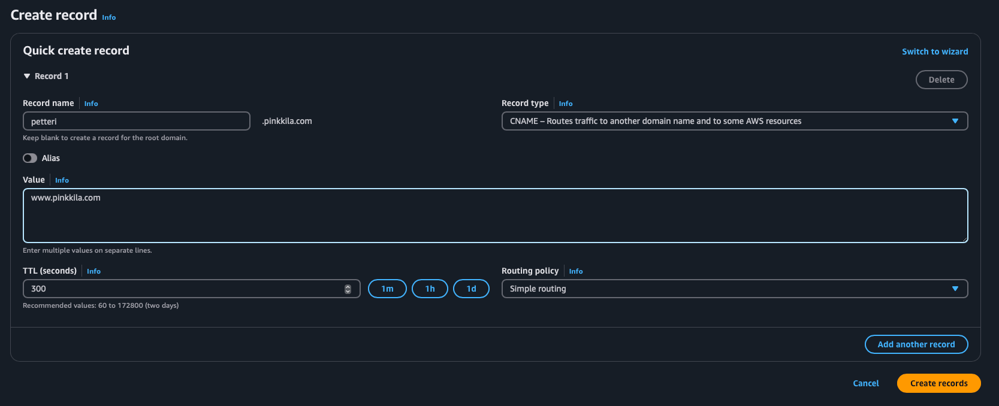

Jolloin:

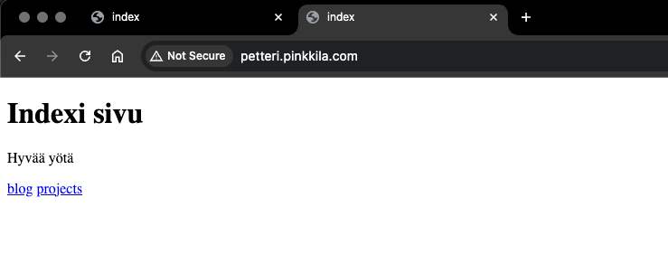

En ole nyt ihan varma toimiiko tämä AWS Route 53 ihan samalla tavalla kuin kaikki muut vastaavat palvelut, mutta en tiedä oliko se aiemmin tekemäni wwww alias jo tavallaan ali domain? Ainakin se tehtiin ihan samalla tavalla 🤔 Vaatii lisää tutkimista. 

### e) Tutki jonkin nimen DNS-tietoja 'host' ja 'dig' -komennoilla. Käytä kumpaakin komentoa kaikkiin nimiin ja vertaa tuloksia. Katso man-sivulta, miten komennot toimivat - esimerkiksi miten 'dig' näyttää kaikki kentät. Analysoi tulokset, keskity nimipalvelimelta tulleisiin kenttiin (dig näyttää paljon muutakin tietoa). Etsi tarvittaessa uusia lähteitä haastaviin kohtiin. Sähköpostin todentamiseen liittyvät SPF ja DMARC -tietojen yksityiskohdat on jätetty vapaaehtoiseksi lisätehtäväksi. Tutkittavat nimet:

Testailin molempia komentoja ja en löytänyt host:lla sellaista, mitä ei näkisi "enemmän" dig:llä joten päätin käyttää tämän tehtävän havaintojen kirjaamisessa dig komentoa. 

Tässä tehtävässä käytin lähteenä Learn Linux TV kanavan videota [How to Use the dig Command in Linux | DNS Lookup Tutorial](https://www.youtube.com/watch?v=_6aL4m8aDjc)

- Oma domain-nimesi. Vertaa tuloksia nimen vuokraajan (namecheap.com, name.com...) weppiliittymässä näkyviin asetuksiin.

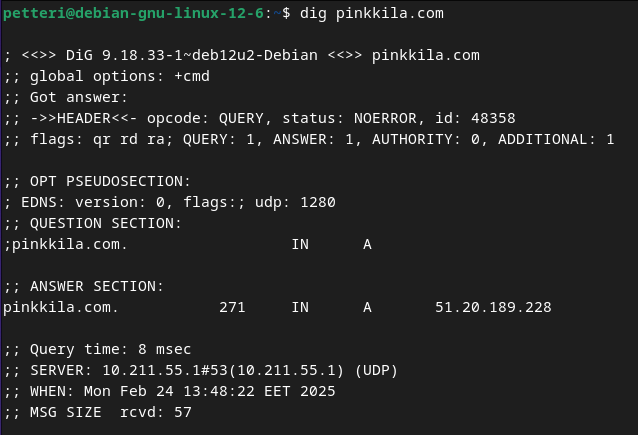

ANSWER SECTION:  51.20.189.228 on pinkkila.com IP-osoite. 

ANSWER SECTION: TTL (time to live = kauan record on välimuistissa ja clientin pitää hakea se uudelleen) on 271 (asetin sen 300 sekuntiin, mutta näköjään ei anna sitä täysin samaa arvoa?)

Query time: 8 msec (millisekunteja kuinka kauan kyselyssä meni)

Mietin että, tuleeko tämä todella udp protokollalla, mutta sitten löysin dig man:

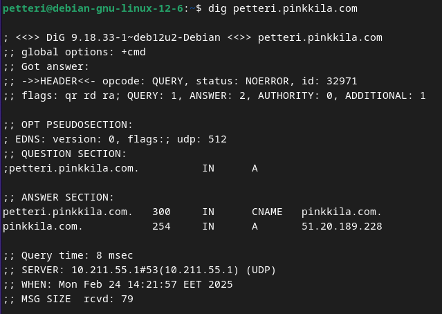

Alidomainin dig komennolla näkee, että kyseessä on cname, joka osoittaa pinkkila.com, joka on A Record.

Lisäämällä MX näkee mail servicen (MX = mail exchange), joka on kytketty domainiin. Olettaisin tämän olevan AWS:n lisäämä, koska en ainakaan muistaakseni laittanut domainiini, että AWS tilini sähköposti tulisi kytketyksi domainiin. 

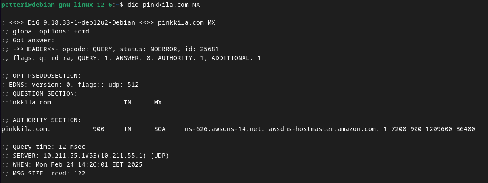

Lisäämällä TXT näkee teksti recordit (teksti recordeja käytetään kun halutaan todistaa validoida domainin omistus). Olen ymmärtääkseni jonkinlaisen validoinnin suorittanut kun hankin domainin tai ainakin jonkinlainen tarkistus tapahtui oston yhteydessä. En ole kyllä varma liittyykä se tähän. Tulosteesta ilmenee (kuten edellisestäkin), että aws-dns vastaa dns palvelusta.

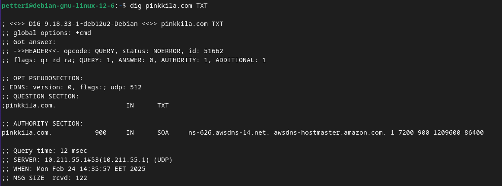

NS eli name server näyttää seuraavaa. Tästä näkyy, että aws toimii dns sivullani hostaa aws. Oletettavasti servereitä on listattuna useampia ja eri maissa (tämä on toki itseni kohdalla vain arvaus ja perustuu siihen, että erikseen on co.uk), jotta voidaan taata hyvä saatavuus.   

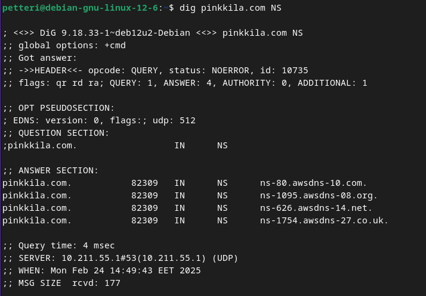

- Jonkin pikkuyrityksen, kerhon tai yksittäisen henkilön weppisivut. (Ei kuitenkaan kurssikaverin tällä viikolla vuokrattua nimeä).

Valitsin Kitarapajan https://www.kitarapaja.com (ei ihan pieni, mutta ei varmaan loppujen lopuksi hirveän suurikaan).

Kitarapaja näyttää käyttävän webhotelli-nimistä nimipalvelua. Googlailun perusteella webhotelli on Suncomet nimisen yrityksen domainnimipalvelu: https://suncomet.fi/domainit/. TTL kitarapajalla näyttää olevan puoli tuntia. 

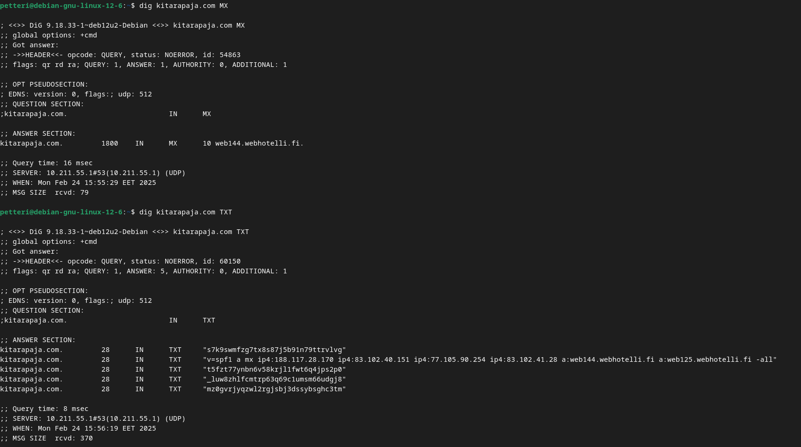

- Jonkin suuren ja kaikkien tunteman palvelun tiedot.

Päätin valita coca-cola.com. Googlailun jälkeen selvisi, että gslb on [global server load balancer](https://www.ibm.com/think/topics/global-server-load-balancing), joka käytetään internet-liikenteen jakamiseen usealle geograaffiselle aluella. Jotain tälläistä käytettetään varmastikin myös suoraan nettisivulla, koska kun kirjoitin selaimen osoitekenttään coca-cola.com, ohjautuu sivu suoraan fi-sivuille.  Coca-colalla näyttää olevan usemapi rivi teksti recordeissa, joista osa on suoraan verification nimellä. 

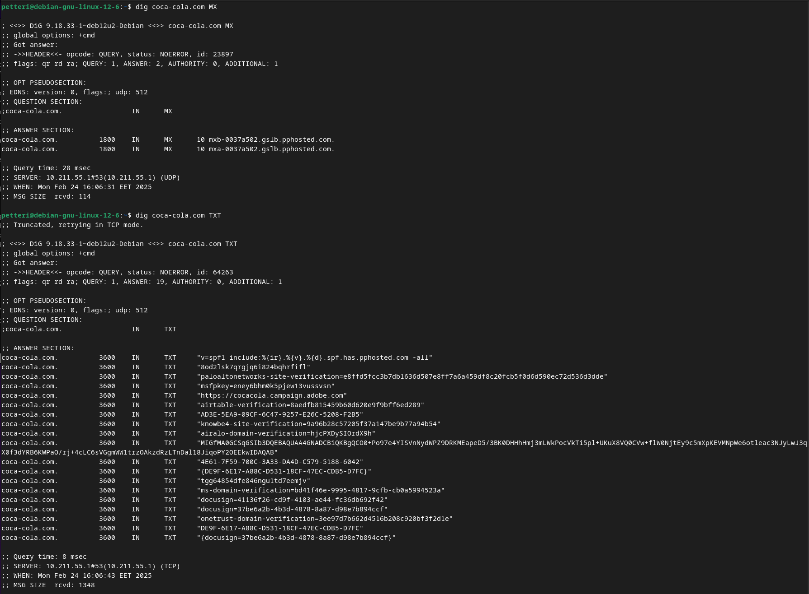

### f) Vapaaehtoinen bonus: Aakkossalaattia sähköpostiin. Etsi palvelu, jonka DNS-tiedoissa on SPF ja DMARC. Selitä näiden kenttien osat ja vaikutukset yksityiskohtaisesti. Voit halutessasi käyttää tulkinnan apuna jotain ohjelmaa tai palvelua, kunhan selität ja tulkitset lopputuloksen myös itse.

Coca-Colalla oli spf mainittuna ANSWER SECTION:ssa kahteen kertaan:

coca-cola.com.		3600	IN	TXT	"v=spf1 include:%{ir}.%{v}.%{d}.spf.has.pphosted.com -all"

coca-cola.com.		3600	IN	TXT	"msfpkey=eney6bhm0k5pjew13vussvsn"

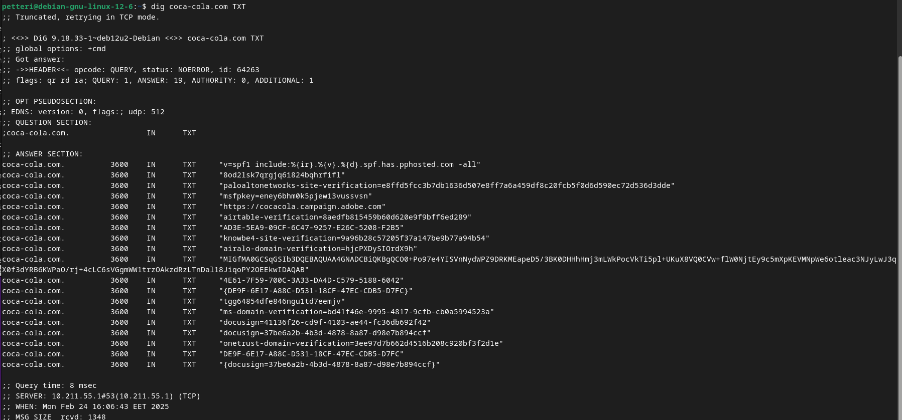

SPF eli Sender policy framework on sähköpostien autentikointi tapa, joka varmistaa, että lähettävä sähköpostipalvelin on authorisoitu lähettämään säköpostia lähettäjän domainista. Lähde wikipedia: [Sender Policy Framework](https://en.wikipedia.org/wiki/Sender_Policy_Framework).

Lähde miten dmarc voi käyttää: [cisco](https://www.cisco.com/c/en/us/support/docs/security/secure-email-gateway/217073-how-to-use-dig-nslookup-to-find-spf-dki.html#anc6)

DMARC eli Domain-based Message Authentication, Reporting and Conformance, toimii SPF:n ja DomainKeys Identified Mail (DKIM) kanssa suojatakseen käyttäjää huijaus-, spam- ja kalastelu-hyökkäyksiltä. DMARC mahdollistaa raportoinnin ja monitoroinnin  aimminlueteltujen hyökkäysten yrityksille. Lähde [nslookup](https://www.nslookup.io/learning/dmarc-a-practical-guide/) (Aika hyvä guide tää!)

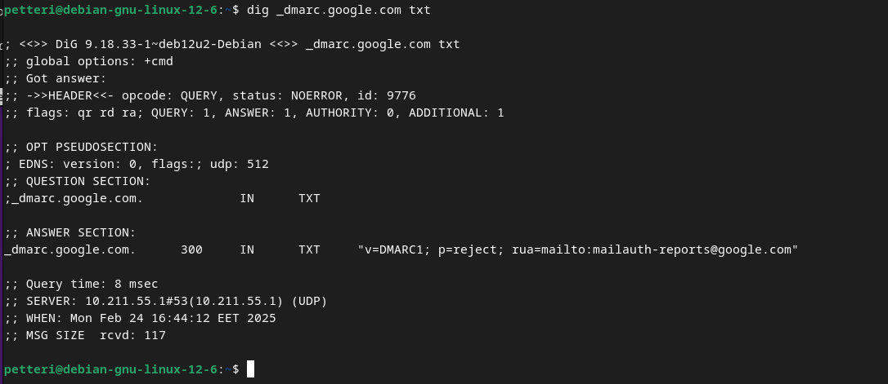

## Lähteet

Tiny Technical Tutorials. Amazon Route 53 Basics Tutorial | Domain Registration, A Records, CNAME Records, Aliases, Subdomains: https://www.youtube.com/watch?v=JRZiQFVWpi8&t=396s

AWS. Simple Routing: https://docs.aws.amazon.com/Route53/latest/DeveloperGuide/routing-policy-simple.html

AWS. Values specific for simple records: https://docs.aws.amazon.com/Route53/latest/DeveloperGuide/resource-record-sets-values-basic.html

AWS. How to Redirect Domains Using Amazon Route 53: A Step-by-Step Guide: https://aws.amazon.com/awstv/watch/47ebee0e261/ 

Lear Linux TV. How to Use the dig Command in Linux | DNS Lookup Tutorial: https://www.youtube.com/watch?v=_6aL4m8aDjc

Suncomet. https://suncomet.fi/domainit/

IBM. Global server load balancer: https://www.ibm.com/think/topics/global-server-load-balancing

Wikipedia. Sender Policy Framework: https://en.wikipedia.org/wiki/Sender_Policy_Framework

cisco. dmark: https://www.cisco.com/c/en/us/support/docs/security/secure-email-gateway/217073-how-to-use-dig-nslookup-to-find-spf-dki.html#anc6

nslookup. DMARC: A practical guide: https://www.nslookup.io/learning/dmarc-a-practical-guide/ 